# Theatre-API-Service
This project is a comprehensive theater management system built using Django.

## Introduction

This is a Django-based API for managing plays, performances and orders. 
The API supports various CRUD operations and filtering capabilities.

## Installation

Before you can run this project, make sure you have the following installed:

- Python 3.8 or higher
- Django 3.2 or higher
- pip (Python package installer)
- Docker (if you prefer running the API in a container)

## Running the API with Python

```sell
git clone https://github.com/TIgor22/Theatre-API-Service.git
cd Theatre-API-Service
python3 -m venv venv
source venv/bin/activate (on macOS)
venv\Scripts\activate (on Windows)
pip install -r requirements.txt

python manage.py migrate
python manage.py createsuperuser
python manage.py runserver

(The API will be available at http://127.0.0.1:8000/.)

python manage.py test

```

## Running the API with Docker

```sell
git clone https://github.com/TIgor22/Theatre-API-Service.git
cd Theatre-API-Service

create an .env file in the root directory of project:
    DB_NAME=your_db_name
    DB_USER=your_db_user
    DB_PASSWORD=your_db_password
    DB_HOST=db
    DB_PORT=5432
    SECRET_KEY=your_secret_key

docker-compose build
docker-compose up
- Create new admin user. `docker-compose run app sh -c "python manage.py createsuperuser`;
- Run tests using different approach: `docker-compose run app sh -c "python manage.py test"`;
```

## Features:

- JWTauthentication;
- Admin panel /admin/;
- Documentation is located at "api/doc/swagger/" or "api/doc/redoc/";
- Managing orders and tickets;
- Creating genres, actors, theatre halls, plays and performance
    only for admin users;
- Filtering plays by: genres, actors;
- Filtering performances by: play_title;


## Demo

    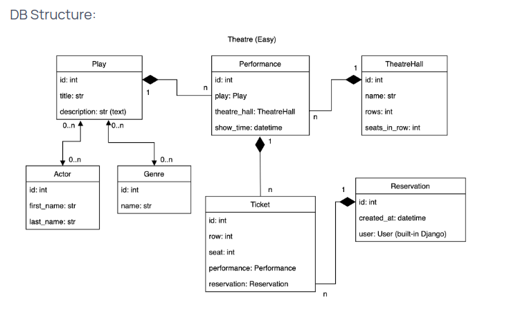

### Screenshots

    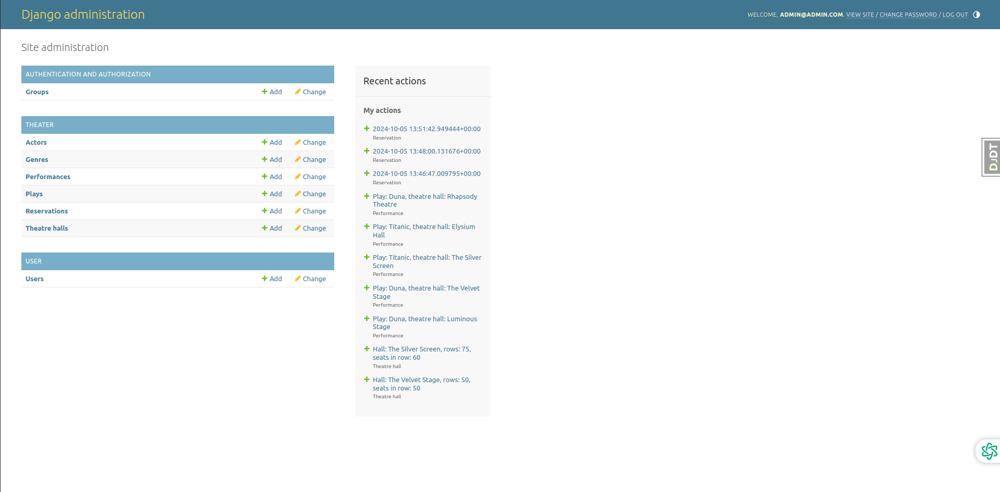
    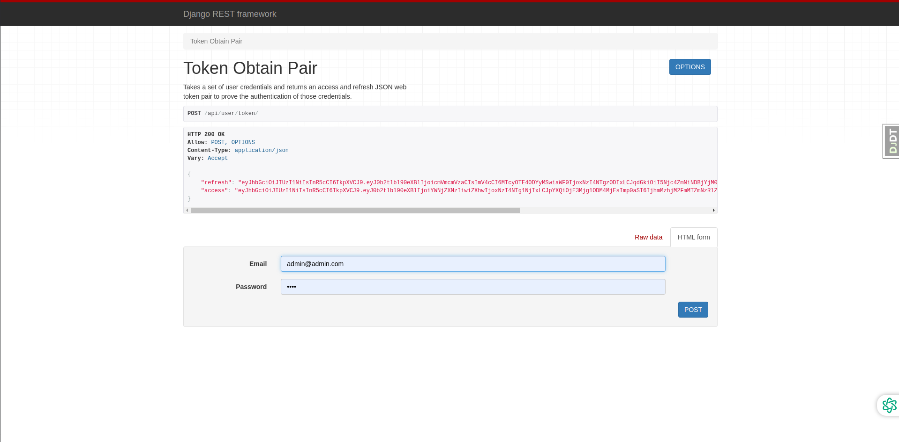
    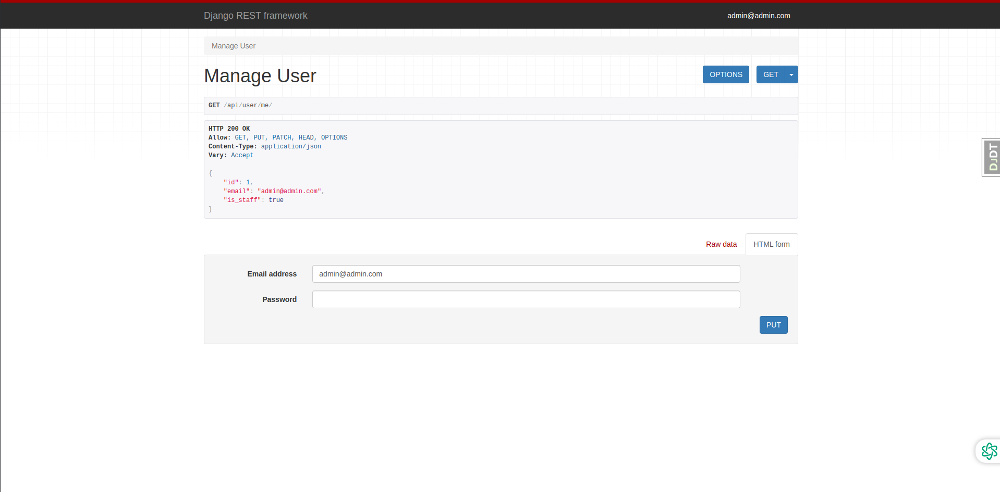
    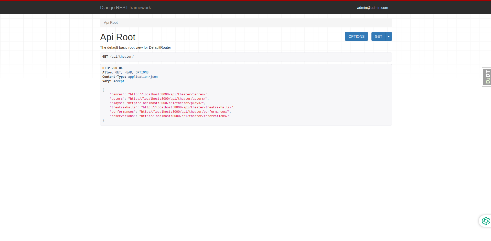
    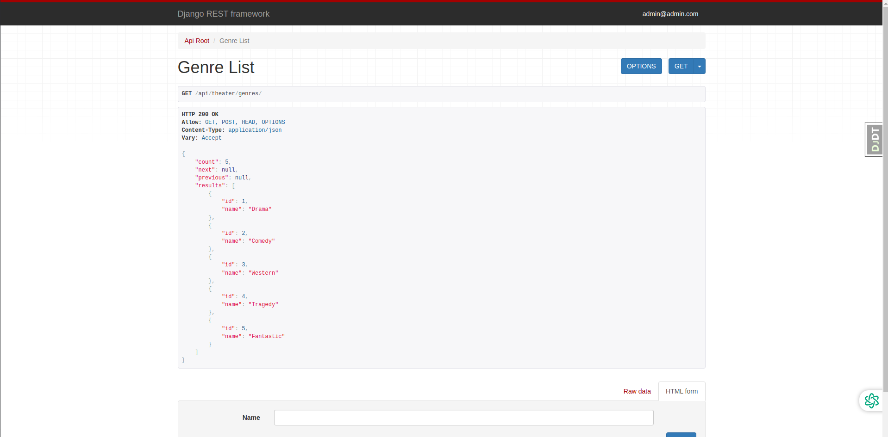
    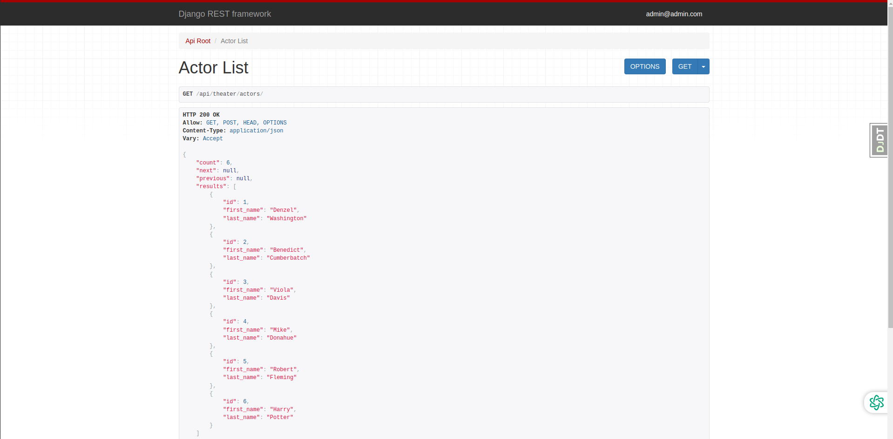
    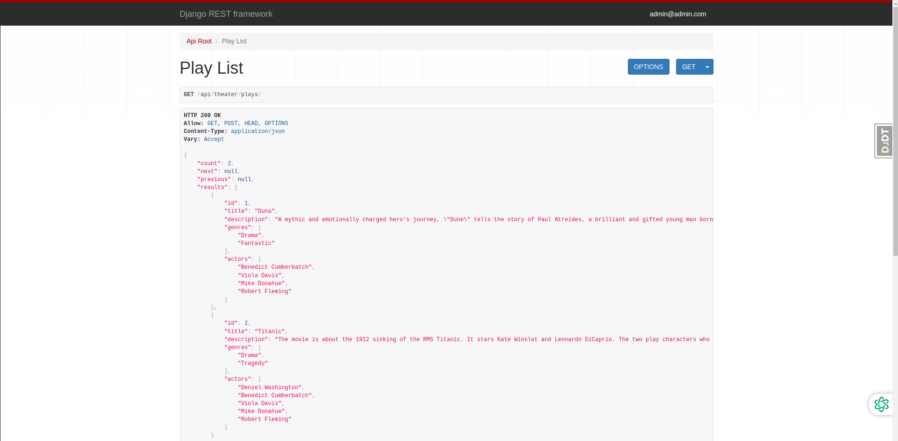
    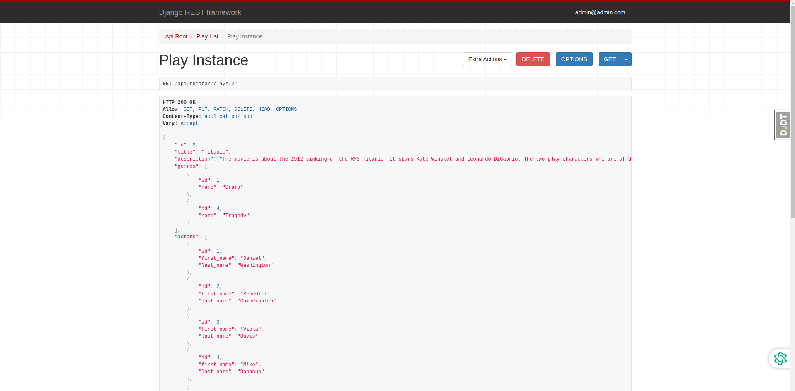
    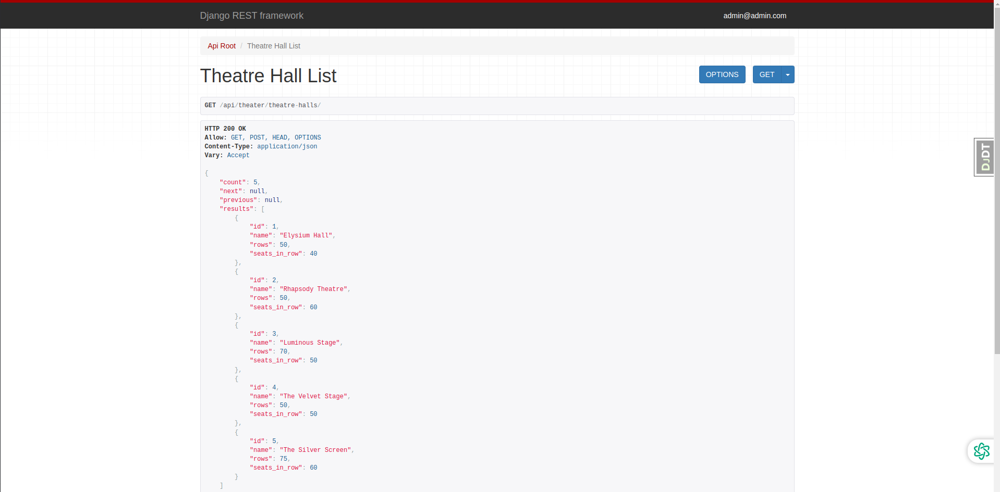
    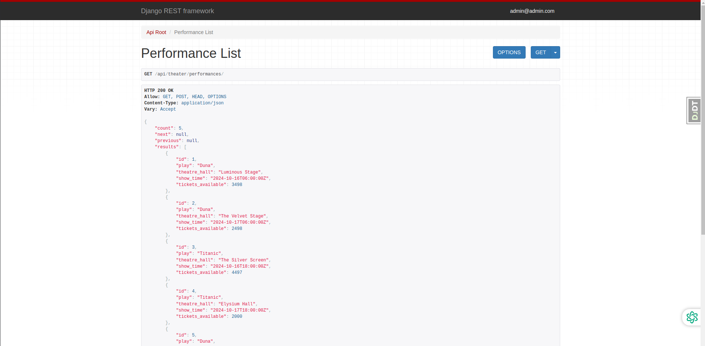
    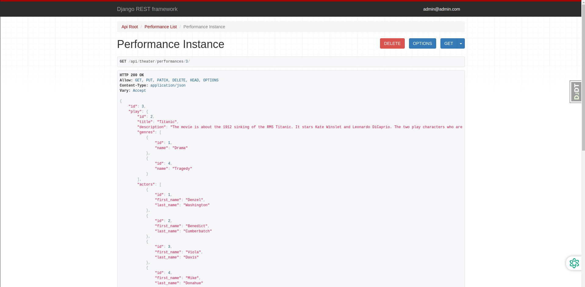
    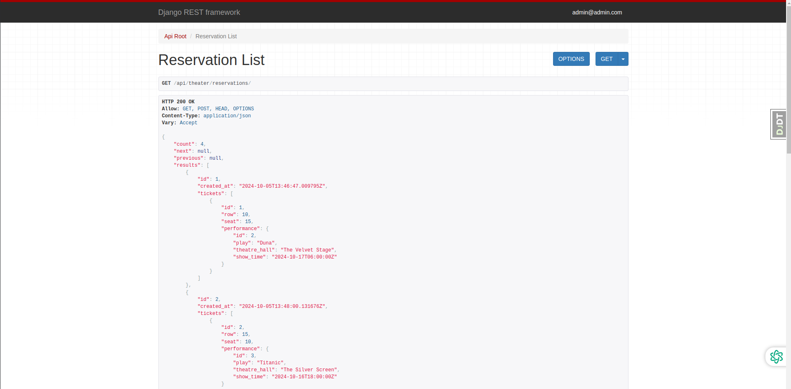
